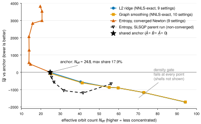
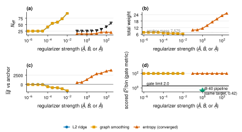
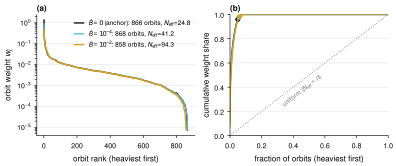

# Full-space 正则化战役:三条线的审阅报告

冻结问题:nphi4 全空间内问题,设计矩阵 (1040, 5967),ridge λ=1e-6;
锚点解(μ=ρ=λ=0,即 ridge-NNLS 参考解)N_eff=24.8、最大轨道份额 17.9%、
总质量 Σw=7.575、χ²/row=0.4552、速度目标 J=139620.6、density gate=False。
全部结果为单种子;frontier 线是实测设置点的连线(引导线),非插值。

**图 1 · 三种正则化的"浓度–动力学"前沿。** L2 与 graph smoothing 沿
N_eff 24.8→94 移动时 ΔJ 改善约 −1720(两线几乎重合,收敛到同一终点);
收敛后的熵解向右下移动——N_eff 反降至 14–21 且 ΔJ 恶化至 +3820,与父
run(SLSQP,虚线,全部未收敛)给出的"单调改善"读数相反。每个设置点在
所有四条扫描中 density gate 均为 False。

**图 2 · 各旋钮到底移动了什么。** (a) L2 与 graph 的浓度响应曲线几乎
重合,熵(收敛)把浓度推得更低;(b) 熵的质量膨胀 7.575→25.2 是其退化
的直接证据——无质量约束的 w·log(w/n) 在欠定设计的近零空间收割负熵,
L2/graph 线无此量(log 未记录 Σw);(c) ΔJ:两良态线在网格边缘仍在下降
(每十进制约 −550),J 的内点最优在更远处;(d) 计分 gate 指标对所有
正则化完全不敏感(恒 99.98),距 gate 门槛 2.0 有 50 倍,而同一 synthetic
target 在 r8-40 管线(11250 轨道库)下为 0.42——瓶颈在冻结问题本身。

**图 3 · 真实轨道权重向量(graph 线,run 7ba8c44d 的 seed_weights.npz)。**
(a) 排序权重谱:锚点解 ~800 条轨道承载质量、头部陡峭;ρ=1e-4 时头部
压低、支撑加宽;ρ=1e-2 时支撑 ~2400 条轨道、谱整体变平(注意 log 轴:
尾部每点都是真实非零权重,非数值噪声)。(b) Lorenz 曲线:曲线越贴近
对角线权重越均匀;圆点标出各解的实测 N_eff 位置。

## 端点对账表

| 线 | 求解证据 | N_eff | max share | Σw | ΔJ (速度) | 计分 χ²/bin | gate |
|---|---|---|---|---|---|---|---|
| 锚点 | — | 24.8 | 17.9% | 7.575 | 0 | 99.98 | False |
| L2 (λ→1e-2) | KKT ≤1.4e-15 | 94.15 | 7.6% | —(未记录) | **−1721** | 99.98 | False |
| Graph (ρ→1e-2) | KKT ≈1e-13 | 94.3 | 7.6% | 6.169 | **−1718** | 99.98 | False |
| Entropy 收敛 (μ→300) | zgrad ≤1e-8·scale | 19.7 | 12.8% | **25.23** | **+3819** | 99.98 | False |
| Entropy SLSQP (μ→300) | pgrad 19–35(未收敛) | 56.1 | 11.0% | — | −668 | 99.98 | False |

## 结论

1. 内问题的解流形上,密度数据对权重分布零约束(N_eff 24.8→94.3,
   设计 χ² 与计分 χ² 均纹丝不动)——权重选择权完全在正则化/先验。
2. 熵按现有形式(绝对权重上的无约束 KL)在本设计上退化:真最优通过
   质量膨胀收割负熵;父节点的"单调浓度响应"是 SLSQP 未收敛的伪影
   (μ=100 处收敛解 inner objective 470.0 优于 SLSQP ~472.2)。
3. L2 与 graph 两条独立前沿在同一终点(N_eff≈94、ΔJ≈−1720)汇合,
   暗示流形上存在正则化无关的"动力学更优"方向;且 ΔJ 在网格边缘仍
   在下降。
4. Density gate 对本冻结问题不可达(99.98 vs 2.0,同一 target 下
   r8-40 管线 0.42)——gate 瓶颈在冻结的轨道库/设计,不在正则化。

## 数据与证据来源

| 产物 | 来源 |
|---|---|
| `data/graph_scan.json`, `data/graph_seed_weights.npz` | run 7ba8c44d(graph 节点,commit 877ffa4) |
| `data/l2_scan.csv` | run a3d9dc34(L2 前沿节点,commit 80609ff)日志内嵌 CSV |
| `data/entropy_newton_scan.csv` | run 144acf4a(Newton 节点,commit 58ab11b)的 scan.json——**在被 7ba8c44d 覆写前读出**,与该 run 日志逐点一致 |
| `data/entropy_slsqp_scan.csv` | run d8e30cd1(熵温度扫描节点,commit b4ee735)日志 |

事故记录:run 之间共享的 `.agent-local` 符号链接导致后跑的 run 覆写
先跑的 scan.json/seed_weights.npz(entropy-newton 的权重存档因此丢失,
本报告的权重图只有 graph 线);修复(run 专属输出目录)已落在 baseline
分支 commit dfff47a。每个数字均可回溯到对应 run 日志(orx logs <runId>)。
