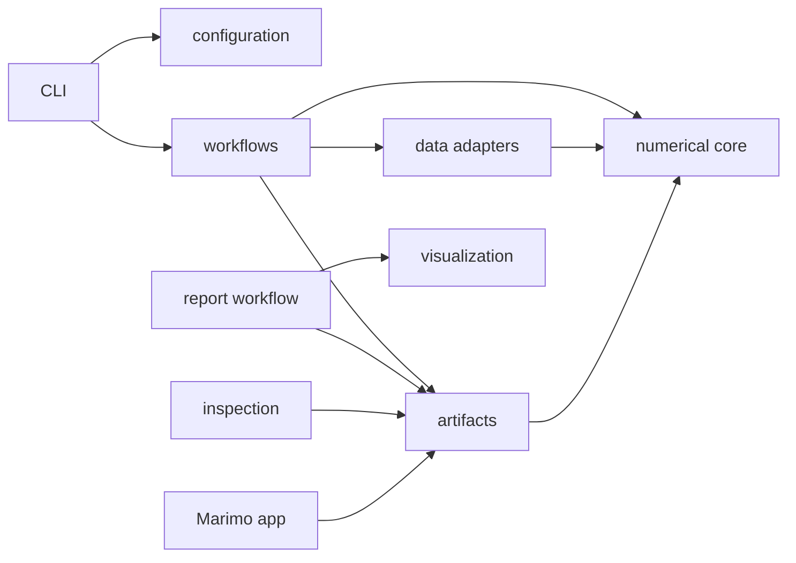

# Repository architecture

## Stable numerical contract

The numerical core under `halo_mw_lmc/core/` accepts only explicit typed
values and NumPy-compatible arrays:

| Quantity | Contract |
| --- | --- |
| Seed phase space | `float64 (N,6)`, columns `(x,y,z,vx,vy,vz)`, kpc and km/s |
| Seed weights | `float64 (N,)`, finite and non-negative; fixed from catalogue or profiled per trial |
| Target density/error | `float64 (n_R,n_z,n_phi)`, strict `(R,z,phi)` order |
| Analytic density grid | Cell-volume averages using `u=R^2/2`, `z`, `phi` quadrature |
| Orbit samples | `float64 (M,6)` plus integer parent `seed_index (M,)` |
| Orbit density response | CSR `(n_cells,n_successful_orbits)`, C-order flattened `(R,z,phi)` rows |
| Velocity grid | `(r,theta,phi,v)`, radians and km/s, 201 fitting bins by default |
| Trial result | `ModelEvaluation` containing arrays and scalars, never paths or figures |

The metadata-free legacy density file is flattened in `(z,R,phi)` order and is
accepted only for the historical 25x25x4 grid. Its transpose into the core
order happens exactly once in `data/density_target.py`. Custom grids use an NPZ
target carrying explicit `r`, `z`, and `phi` edges, which are checked before
model evaluation.

## Dependency direction

The forbidden reverse edges are enforced by tests:

- `core` does not import configuration, datasets, workflows, plotting, Astropy,
  Matplotlib, scikit-optimize, or Marimo;
- optimization does not import visualization or reporting;
- Marimo does not import optimization, orbit integration, or potentials.

AGAMA is imported lazily by the numerical backend adapters because it is
required only when a trial is actually evaluated.

## Configuration ownership

The reusable recipe owns scientific choices: potential, grid edges, fit masks,
velocity likelihood, weight model, outer objective, orbit sampling, search coordinates,
bounds, and rounding.
The run file owns data paths, run identity, output path, iterations, random
seed, coverage display settings, and report-only velocity coarsening.

The outer configuration layer resolves TOML and constructs
`ZhuComparisonConfig`. Core functions never know which file supplied a value.
The resolved JSON written into every run is the provenance record used by
analysis; the checked-in TOML remains the human-editable source.

## Execution and artifacts

`workflows/preflight.py` owns stage-aware dependency, input, grid, weight-audit,
and output-conflict checks. For `run`, it reads catalogue and target exactly once
and hands the prepared arrays to the numerical path before any run directory is
created. Coverage uses a separate catalogue-only payload and never reads the
target or probes numerical dependencies.

Expensive integration is confined to `workflows/optimization.py`. A common trial
loop writes one sample row per evaluated point and replaces only the current best
snapshot. Its fixed wrapper consumes explicit points sequentially and never
imports skopt; its adaptive wrapper alone owns `Optimizer.ask/tell`. Evaluation,
adaptive `tell()`, and persistence receive the same rounded coordinates.

The default `run` lifecycle is validate → preflight/prepare → fixed evaluation or
adaptive optimization → numerical artifact inspection → managed report → saved
inspection. Numerical failure preserves partial artifacts. A report failure does
not invalidate completed numerical artifacts.

`inspection.py`, reporting, and Marimo consume artifacts. They do not reopen the
source catalogue and never reconstruct missing results through AGAMA. Managed
`report/` publication is staged and validated before an optional directory
replacement. `inspection.json` is a derived cache; resolved configuration,
`sample.dat`, and `best/` remain authoritative.

## Weight-model boundary

Both weight modes share preparation, orbit integration, density comparison,
velocity likelihood, optimization, and artifact code. Only the weight provider
inside one evaluation changes:

- `catalogue_fixed` maps the catalogue `w` column to every orbit sample and
  preserves the historical global density normalization;
- `density_solved` builds a sparse equal-time orbit response, profiles one
  non-negative weight per successful seed against the target density, and
  distributes each solved orbit weight over that orbit's actual finite samples
  for velocity scoring.

The sparse response and solver live in `core/`; neither knows about TOML, paths,
AGAMA, optimization, or plotting. No-Fixed uses density normalization `none` so
there is no weight/scale degeneracy. Failed seed integrations retain zero slots
in the persisted full-catalogue weight vector.

## Extension rules

- A new equation, grid algorithm, or reusable array diagnostic belongs in
  `core/` and must be testable with small in-memory arrays.
- A new survey/file format belongs in `data/` and translates into the existing
  core contract.
- A new expensive execution mode belongs in `workflows/` and writes versioned
  artifacts.
- A simulation-derived target is generated by an explicit workflow into the
  existing target NPZ contract; source catalogues and plotting scripts never
  become core runtime dependencies.
- A new figure belongs in `visualization/`; the optimizer must not import it.
- A new interactive view reads artifacts from `apps/` and must not trigger
  model evaluation.
- Historical code stays under `archive/` and is never used as a compatibility
  dependency of the active package.
